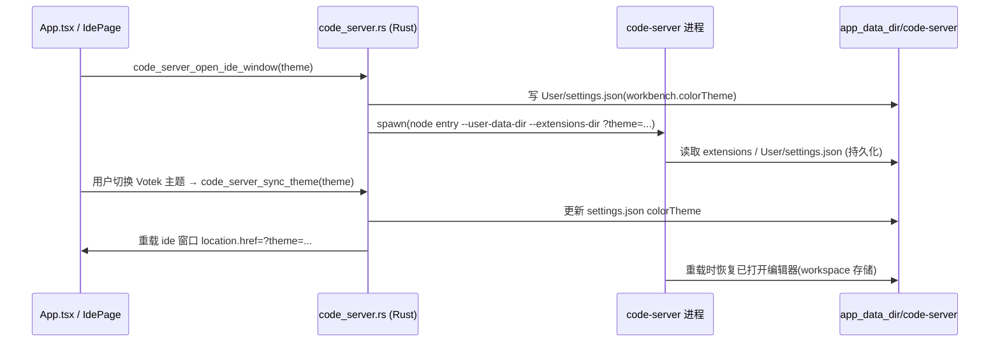

## 用户需求
完善 Votek 内置 IDE（code-server 独立窗口架构）的两项遗留能力：
1. 插件与设置持久化：应用/IDE 重启后，已安装的扩展和编辑器配置不丢失。
2. 主题与 Votek 自动同步：IDE 的明暗主题跟随 Votek 的 dark/light 设置，切换时实时跟随，重启后沿用。

## 产品概述
当前 IDE 以独立 Tauri 窗口加载 code-server，启动命令 `code_server_open_ide_window`。扩展与设置已通过 `--user-data-dir` 落入应用数据目录实现基本持久化，但存在路径 fallback 脆弱、缺少显式扩展目录、且主题完全未与 Votek 联动的问题。本次在现有架构上补齐这两点，不引入 embed 改造。

## 核心功能
- 扩展与用户设置（如编辑器配置、键位）稳定持久化，重启不丢失；并记忆上次打开的工作区路径。
- 打开/重载 IDE 时根据 Votek 当前主题（解析 system 为实际明暗）自动套用对应 code-server 主题。
- Votek 主题切换时，已打开的 IDE 窗口实时同步主题，无需手动重启。


## 技术栈
- 后端：Rust（Tauri v2 命令），沿用 `code_server.rs` 现有进程管理模型。
- 前端：React + TypeScript + Zustand（`appStore.ts`），纯 CSS（无 Tailwind）。
- 持久化：code-server 自带 `--user-data-dir` / `--extensions-dir` + `User/settings.json`；应用数据目录由 Tauri `app.path().app_data_dir()` 提供（跨重启保留）。
- 主题机制：code-server 支持 CLI `--theme`、URL `?theme=` 查询参数，并将 `workbench.colorTheme` 持久化到 `User/settings.json`（启动时读取）。内置恒可用主题名：`Default Dark+`（深色）、`Default Light+`（浅色）。

## 实现方案
### 总体策略
两项能力均在「独立窗口」架构上实现，复用 `spawn_code_server` 的启动链路，不改动窗口创建逻辑。
- 持久化：在启动前显式声明 `--extensions-dir`，并将数据/日志目录的 fallback 从「相对 CWD」改为稳定的文档目录，杜绝路径退化导致数据丢失；可选地把上次工作区写入 `config.json` 以便重启复用。
- 主题同步：采用「双保险」——启动前把 `workbench.colorTheme` 写入 `settings.json`，同时给 IDE 窗口 URL 追加 `?theme=<映射名>`。二者一致互为兜底。实时同步通过新增命令更新 `settings.json` 并重载窗口 URL 实现；code-server 重载会从持久化 workspace 存储恢复已打开的编辑器，体验可接受。

### 关键技术决策
1. **显式 `--extensions-dir`**：默认扩展目录即 `<user-data-dir>/extensions`，但显式声明可让路径清晰、便于排查，且与用户数据目录解耦管理。
2. **修复 `unwrap_or_default()` fallback**：原 `cs_data_dir`/`cs_logs_dir` 在 `app_data_dir()` 失败时退化为相对当前工作目录的路径，安装态/特殊环境下会导致扩展与设置随 CWD 丢失。改为回退到 `dirs_next::document_dir()` 拼 `Votek/code-server`，保证绝对且持久。
3. **双通道主题应用**：仅用 `?theme=` 可能被已持久化的 `settings.json` 覆盖；仅写 `settings.json` 则无法在不重启进程时触发 webview 重新加载。二者结合，初始加载与实时重载均可靠。
4. **system 主题解析放前端**：`appStore` 已有 `applyTheme` 用 `matchMedia` 解析 system；前端在调用处把 `system` 解析为具体 `dark/light` 再传给后端，后端只认 `dark/light` 两态，职责清晰。

### 性能与可靠性
- 写入 `settings.json` 采用「读-改-写 + JSON merge」，仅覆盖 `workbench.colorTheme` 字段，不破坏用户其他设置；文件不存在时创建默认 `{"workbench":{"colorTheme":...}}`。
- 主题实时同步仅在该 label 为 `ide` 的窗口存在时触发重载，无窗口时不产生副作用；重载用 `window.location.href = url`，轻量。
- 路径解析均为同步本地文件操作，开销可忽略；不改变 code-server 进程生命周期与热备逻辑。

## 实现要点
- 复用现有 `format_cs_url`、窗口 label 常量 `CS_WINDOW_LABEL = "ide"`、`get_webview_window` 等，不新增全局状态。
- 新增命令需在 `lib.rs` 的 `#[tauri::command]` 注册列表中登记（与 `code_server_open_ide_window` 等同位置）。
- 前端订阅：`appStore` 的 `theme` 变更在 `App.tsx` 用 `useEffect` 订阅（参考现有 `applyTheme` 模式），解析后若 IDE 窗口存在则 `invoke("code_server_sync_theme", {theme})`；`IdePage.handleOpen` 打开时传入当前解析后的主题。
- 日志延续现有 `eprintln!("[CodeServer] ...")` 风格，避免打印 secrets。

## 架构设计


## 目录结构
```
agent-desktop/src-tauri/src/
├── code_server.rs        # [MODIFY] 1) cs_data_dir/cs_logs_dir 改用稳定 fallback；
│                         #          2) spawn_code_server 增加 --extensions-dir 参数，
│                         #             启动前写 workbench.colorTheme 并接收 theme 参数；
│                         #          3) code_server_open_ide_window 增加 theme: Option<String>，
│                         #             URL 追加 ?theme=<映射名>；
│                         #          4) 新增 code_server_sync_theme(app, theme) 命令；
│                         #          5) 新增 cs_extensions_dir / cs_user_settings_path /
│                         #             write_color_theme / cs_theme_name 辅助函数；
│                         #          6) 可选：上次工作区持久化到 config.json 并复用。
└── lib.rs                # [MODIFY] 注册新命令 code_server_sync_theme（与现有 code_server_* 同区）。

agent-desktop/src/
├── App.tsx               # [MODIFY] 订阅 appStore.theme，解析 system→实际明暗，
│                         #            IDE 窗口存在时调用 code_server_sync_theme。
├── pages/IdePage.tsx     # [MODIFY] handleOpen 调用 code_server_open_ide_window 时传入当前主题。
└── stores/appStore.ts    # [参考] 复用 ThemeMode / setTheme / applyTheme，无需改动；
                          #       前端在调用处解析 system 为 dark/light。
```

## 关键代码结构
```rust
// code_server.rs 新增/调整的核心契约
fn cs_extensions_dir(app: &AppHandle) -> PathBuf;
fn cs_user_settings_path(app: &AppHandle) -> PathBuf; // <user-data-dir>/User/settings.json
fn cs_theme_name(votek: &str) -> &'static str;        // "dark"->"Default Dark+", "light"->"Default Light+"
fn write_color_theme(app: &AppHandle, theme_name: &str) -> Result<(), String>; // 读-改-写 settings.json

#[tauri::command]
pub async fn code_server_sync_theme(app: AppHandle, theme: String) -> Result<(), String>;
// 更新 settings.json 的 workbench.colorTheme；若 label="ide" 窗口存在则重载其 URL 带 ?theme=
```

