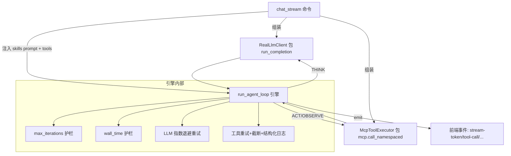

## 用户需求
完善 agent-desktop 的 agent loop 实现：当前 `chat_stream`（`src-tauri/src/lib.rs:157-337`）已内联了一个可用的原生 tool-calling 循环，集成了 MCP 工具聚合与 Skills 注入。本次目标是在此基础上参考开源实现把 loop「做完善」并验证 Skills/MCP 接入，具体：

- 将循环逻辑从 `chat_stream` 抽出为独立模块，通过 trait/闭包做依赖注入，使 loop 可脱离真实 LLM/MCP 进行单元测试（对应 mini_agent 的 provider/tool_dispatcher 注入思想）。
- 复用开源的「可靠性层」逻辑：LLM 调用指数退避重试、工具可重试错误重试、工具结果截断、结构化追踪日志（脱敏 args/duration/error）、格式错误自愈回传。
- 复用开源的「护栏」逻辑：max_iterations（mini-swe-agent 的 step_limit）、wall_time 上限、连续格式错误自愈。
- 验证 Skills（`skills::get_active_system_prompt`）与 MCP（`mcp::llm_tools` / `mcp::call_namespaced`）已正确接入此 loop，并在单测中断言接入。
- 事件协议（stream-token / thinking-start/-delta/-stop / tool-call / tool-result / agent-iteration / stream-done / stream-error）与取消机制（active_streams watch channel + cancel_chat）完全保持不变。

## 核心特性
- 独立可测的 agent loop 引擎（think → act → observe 循环）。
- 依赖注入的 LlmClient 与 ToolExecutor，真实实现包 run_completion 与 mcp.call_namespaced。
- 多层可靠性：LLM 重试、工具重试、结果截断、结构化日志、格式错误回传自愈。
- 多层护栏：最大轮次、墙钟时间上限、取消信号。
- 配套 Rust 单元测试：脚本化 Fake 验证闭环、护栏、截断、取消、Skills/MCP 接入。


## 技术栈
- 语言：Rust（Tauri v2 后端），仅使用现有依赖 `tokio`(full) / `serde_json` / `futures`(0.3) / `tauri`，**不引入新 crate**。
- 异步 trait 方法用 `futures::future::BoxFuture` 表达（避免 async_trait 新依赖）。
- 并行工具执行用 `futures::future::join_all`（对齐 OpenAI Agents SDK 的并行 tool 调用）。

## 实现方案
### 总体策略
把 `chat_stream` 中的循环体抽成 `agent_loop.rs` 的纯引擎 `run_agent_loop`，通过两个 trait 注入真实能力：`LlmClient`(包 `run_completion` 流式调用) 与 `ToolExecutor`(包 `state.mcp.call_namespaced`)。`chat_stream` 退化为「组装真实实现 + 调用引擎」，事件与取消逻辑原样保留。可靠性与护栏作为引擎内部横切逻辑实现，对应 mini_agent `reliability.py` 的 retry/circuit-breaker/tracing 与 mini-swe-agent 的 limits。

### 关键技术决策
1. **依赖注入用 trait + BoxFuture**：`LlmClient`/`ToolExecutor` 定义为返回 `BoxFuture` 的 trait（futures 已具备），真实实现持有 `AppHandle`/请求/`&McpManager` 引用；Fake 实现在 `#[cfg(test)]` 中脚本化返回。无需 async_trait crate。
2. **流式 token 仍在 LlmClient 内 emit**：`run_completion` 当前在流式过程中实时 `app.emit("stream-token")`，抽出为 `RealLlmClient::complete` 后保持该行为，保证 UI 逐字渲染不被破坏。
3. **loop 拥有非流式事件 emit**：`agent-iteration` / `tool-call` / `tool-result` / `stream-done` / `stream-error` 由引擎用 `&AppHandle` 发出，协议不变。
4. **可靠性分层（复用开源）**：
   - LLM 重试：`complete()` 外包指数退避+抖动（参考 `_RetryingProvider`），最多 `llm_max_retries` 次。
   - 工具重试：对 `ToolOutcome.suggested_action == "retry"` 的错误重试 `tool_max_retries` 次（参考 `with_retry`）。
   - 结果截断：工具结果超 `max_tool_result_chars` 截断后回传（参考 mini_agent `result_preview` 截断思想，避免上下文爆炸）。
   - 结构化日志：每次工具调用 log `name / 脱敏args / duration / error`（参考 `traced_call`，对 key/secret/token/password 脱敏）。
   - 格式错误自愈：工具名不在 `tools` 列表或参数解析失败时，返回结构化错误 observation 让 LLM 下一轮自纠（参考 mini-swe-agent 把异常作为 observation 回传）。
5. **护栏**：`max_iterations`（agent=10/chat=1）、`wall_time_limit_secs`、每轮开始检查墙钟与 cancel，超时/取消即 `stream-error` + 返回。

### 性能与可靠性
- 工具并行（`join_all`）降低多工具轮次延迟；单个工具失败不影响同轮其余工具，错误结果作为 observation 回传。
- LLM 重试退避上限固定，避免雪崩；工具重试仅对 `is_retryable()` 生效，避免无效重试。
- 结果截断上限保护上下文窗口，防止超大工具输出拖垮后续调用。

## 架构设计
### 模块关系（Mermaid）


### 数据流
用户消息 + Skills system prompt → 初始 messages → 循环：THINK(LLM 流式+收集 tool_calls) → 无 tool_calls 则 stream-done 返回 → ACT(并行执行工具,截断,emit tool-call/tool-result) → append tool 消息 → 回 THINK；受 max_iterations/wall_time/cancel 约束。

## 目录结构
```
agent-desktop/src-tauri/src/
├── agent_loop.rs      # [NEW] loop 引擎：AgentLoopConfig / LlmClient / ToolExecutor trait / LoopContext / run_agent_loop
│                       #        + 可靠性层(LLM重试/工具重试/截断/日志/格式错误自愈) + #[cfg(test)] Fake 与单测
├── lib.rs             # [MODIFY] chat_stream 改为组装 RealLlmClient + McpToolExecutor 注入并调用 run_agent_loop；
│                       #         保留全部 emit 事件与 cancel；run_completion 保留供 RealLlmClient 复用
├── mcp.rs             # [NO CHANGE] 作为 ToolExecutor 真实后端（llm_tools / call_namespaced 已就绪，验证接入）
├── skills.rs          # [NO CHANGE] get_active_system_prompt 已就绪，验证接入
└── Cargo.toml         # [MODIFY] tauri 依赖追加 "test" feature（供 #[cfg(test)] 用 tauri::test::mock_app）
```

## 关键代码结构
```rust
// agent_loop.rs —— 仅列核心接口（实现体省略）

pub struct AgentLoopConfig {
    pub max_iterations: usize,          // agent=10, chat=1
    pub max_tool_result_chars: usize,  // 默认 8000，结果超长截断
    pub wall_time_limit_secs: u64,     // 默认 300
    pub parallel_tools: bool,          // 默认 true
    pub llm_max_retries: u32,          // 默认 3
    pub tool_max_retries: u32,         // 默认 2
}

pub struct ToolCall { pub id: String, pub name: String, pub arguments: String }
pub struct LlmResponse { pub content: String, pub reasoning: String, pub tool_calls: Vec<ToolCall> }
pub struct ToolOutcome {
    pub result: String, pub is_error: bool,
    pub error_code: Option<String>, pub error_category: Option<String>,
    pub suggested_action: Option<String>, // "retry" | "reconnect" | "none"
}

pub trait LlmClient: Send + Sync {
    fn complete<'a>(&'a self, messages: &'a [ChatMessage], tools: &'a [Value],
                    cancel: &'a mut tokio::sync::watch::Receiver<bool>)
                    -> futures::future::BoxFuture<'a, Result<LlmResponse, String>>;
}

pub trait ToolExecutor: Send + Sync {
    fn execute<'a>(&'a self, name: &'a str, arguments: &'a str)
                   -> futures::future::BoxFuture<'a, ToolOutcome>;
}

pub struct LoopContext<'a> {
    pub app: &'a AppHandle,
    pub config: AgentLoopConfig,
    pub initial_messages: Vec<ChatMessage>,
    pub tools: Vec<Value>,
    pub llm: &'a dyn LlmClient,
    pub executor: &'a dyn ToolExecutor,
    pub cancel: &'a mut tokio::sync::watch::Receiver<bool>,
}

pub async fn run_agent_loop(ctx: LoopContext<'_>) -> Result<(), String>;
```

## 实现注意
- `ChatMessage` 与 `msg_to_value` 已在 lib.rs 定义，agent_loop.rs 通过 `use crate::*` 复用，不重复定义。
- `RealLlmClient` 持有 `app: AppHandle` + `request: ChatRequest` 克隆，其 `complete` 内部调用既有 `run_completion`（保持流式 emit）。
- `McpToolExecutor<'a>` 持有 `&'a McpManager`，`execute` 内部调用 `mcp.call_namespaced(name, args)` 并把 `McpError` 映射为 `ToolOutcome`（复用现有 `is_retryable()/needs_reconnect()` 决定 `suggested_action`）。
- 测试用 `tauri::test::mock_app()` 构造 `AppHandle`，`FakeLlmClient` 脚本化（首轮返回 tool_call，次轮返回最终答案），`FakeToolExecutor` 用 `Arc<Mutex<Vec<(String,String)>>>` 记录调用，断言工具以正确参数被调用、loop 以最终答案结束、max_iterations 护栏生效、结果截断生效、cancel 提前返回。
- 接入验证：在 lib.rs 现有 `chat_stream` 路径不变；单测中对 `mcp.llm_tools()` 返回形状（含 `server::tool` 命名空间）与 `skills::get_active_system_prompt` 非空做断言，证明 Skills/MCP 已接入 loop。
- 不改动前端事件名/载荷结构，避免影响 ChatView.tsx 消费逻辑。

